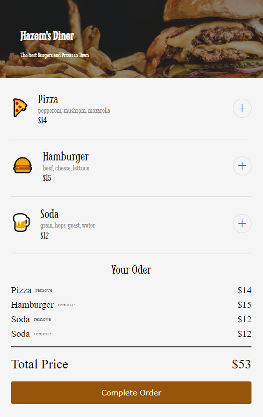
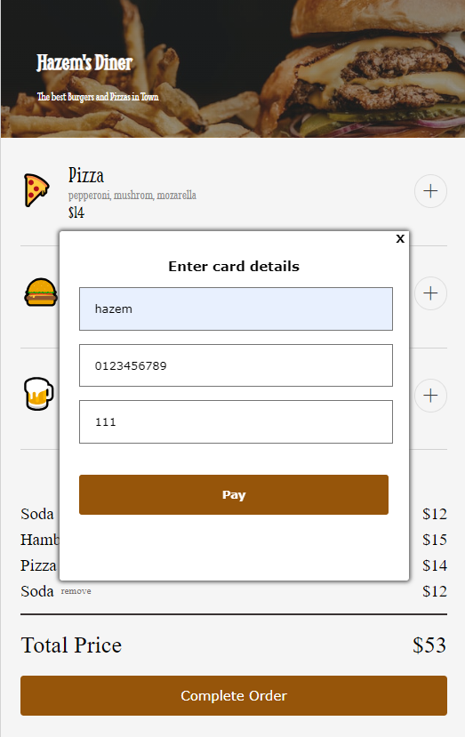
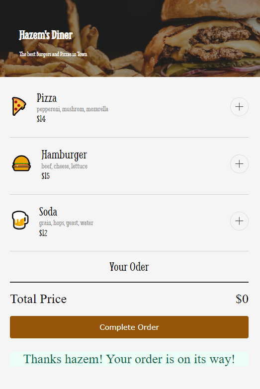

# Restaurant-Ordering-App
This restaurant ordering app is a web application built using HTML, CSS, and JavaScript. It allows users to browse a menu, select items for their order, enter their personal information, and complete the ordering process seamlessly

Features:

 - Menu Display: The app fetches menu data from a data.js file and dynamically displays menu items, including categories, items, and prices, on the screen.
 - Order Selection: Users can easily select items from the menu, add them to their cart, and view the total price of their order.
 - Order Checkout: The app collects user information such as phone number, name, and CVV for payment processing. It validates inputs and provides feedback for any errors.
 - Order Confirmation: After completing the order, users receive a confirmation message informing them that their order is on the way.

